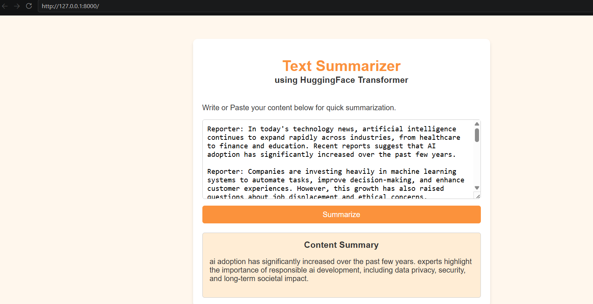

# 🤖 Generative AI: End-to-End Dialogue Summarizer (LLM Pipeline)

An advanced, production-ready Generative AI web application that leverages a fine-tuned **T5 (Text-to-Text Transfer Transformer)** Large Language Model. The system is architected to dynamically process dense, long-form conversations or textual content and synthesize highly accurate, context-aware summaries.

---

## 📸 Application Interface
Behold the beautiful, clean user interface with dynamic summary execution:



---

## 🧠 LLM Architecture & Under-the-Hood Engineering

This project demonstrates a comprehensive implementation of modern NLP pipelines and system design constraints:

### 🔄 The GenAI Core Pipeline
1. **Raw Text Ingestion:** Text is captured asynchronously via a JavaScript Fetch API frontend.
2. **Deterministic Preprocessing:** Standardized regex layer strips newline characters, multiple blank spaces, and rogue HTML tags to shrink tokenization overhead.
3. **Subword Tokenization:** Uses the T5 SentencePiece Tokenizer to convert text into PyTorch tensors with rigorous truncation at $512$ tokens to enforce context window limits.
4. **Autoregressive Generation:** Leverages the Encoder-Decoder transformer blocks using a **Beam Search** strategy ($\text{num\_beams}=4$) and early stopping constraints to construct optimized natural language sequences.

### ⚙️ System Specifications & Core Methods

| Component | Technical Implementation Details |
| :--- | :--- |
| **Model Base** | `T5ForConditionalGeneration` (Sequence-to-Sequence Transformer Architecture) |
| **Data Cleaning** | Regular Expression Pipeline (`re.sub` for lines, spaces, and markup tag sanitization) |
| **Hardware Optimizer** | Runtime Device Routing (`CUDA` / `MPS` hardware accelerators with automated `CPU` fallback) |
| **API Architecture** | Asynchronous **FastAPI** utilizing strict `Pydantic` schemas for structured request validation |
| **UI Delivery** | Direct `FileResponse` engine to eliminate Jinja2 rendering overhead and caching locks |

---

## 🛠️ Tech Stack
- **Core AI/LLM:** Hugging Face Transformers, PyTorch
- **Backend Infrastructure:** FastAPI, Uvicorn, Pydantic
- **Frontend Layer:** Semantic HTML5, CSS3 (Warm Orange Accent-Driven Theme), Asynchronous Native JavaScript

---

## 🚀 Local Installation & Execution Strategy

### 1. Repository Setup
Clone the codebase down to your machine and step into the workspace:
```bash
git clone [https://github.com/saumya443/Text-Summarizer-FastAPI.git](https://github.com/saumya443/Text-Summarizer-FastAPI.git)
cd Text-Summarizer-FastAPI

